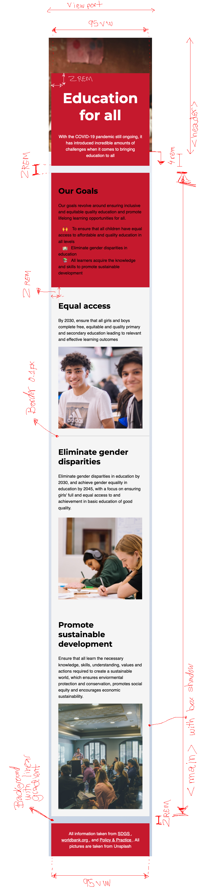
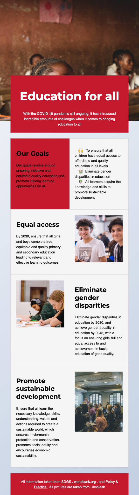
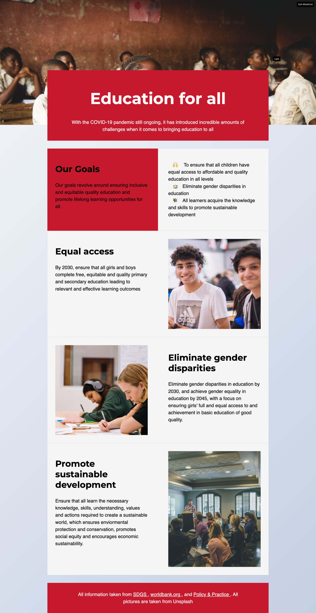

# From wireframe to newsletter

## About the project
This page was created as part of the subject IDG1292 Web coding, a subject on the department of design on NTNU Gjøvik. 

## The task
Follow the already created mock-ups and implement the newsletter using CSS. I also recieved a document with the final HTML structure, and 
I was not allowed to modify it. I was also not allowed to use flexbox and grid layout. 

## Mockups
### Phone
\
### tablet
\
### desktop

## visit the website
It is possible to visit this website both on github pages and folk.ntnu.no
github pages: https://ingring.github.io/style_given_wireframes/index.html
folk.ntnu.no: https://folk.ntnu.no/ingring/lifestyle-import/

